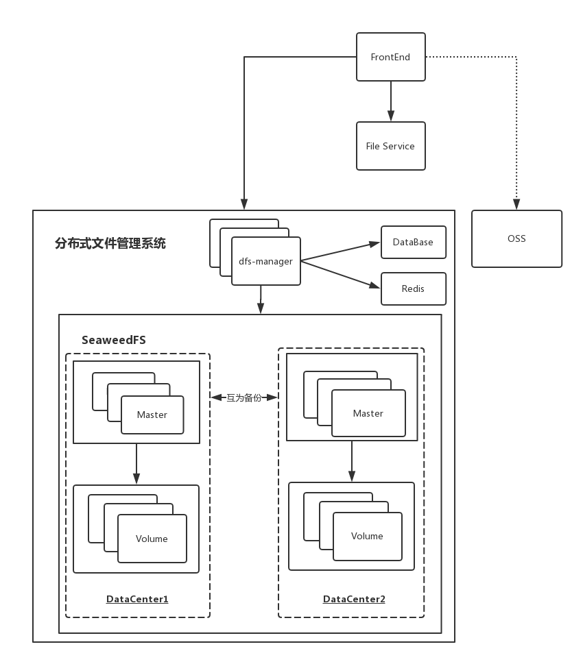
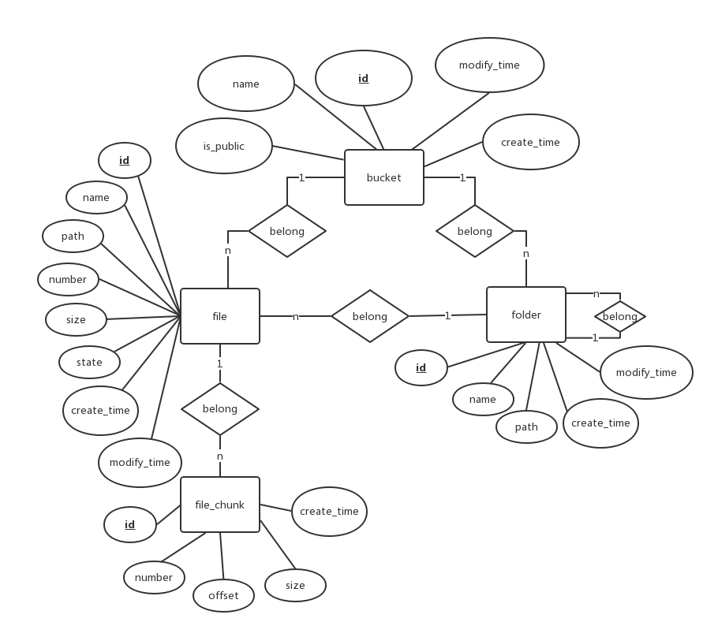
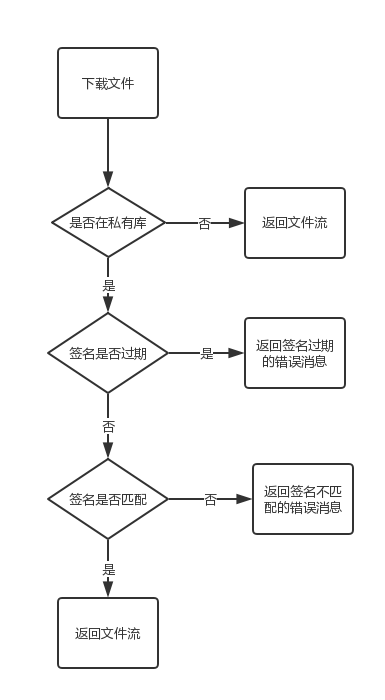
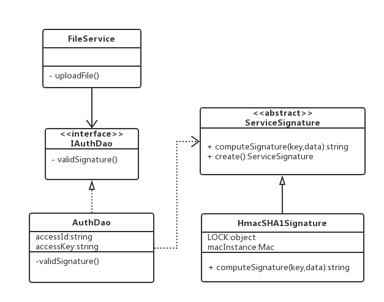
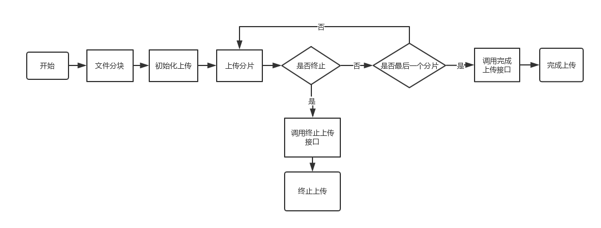
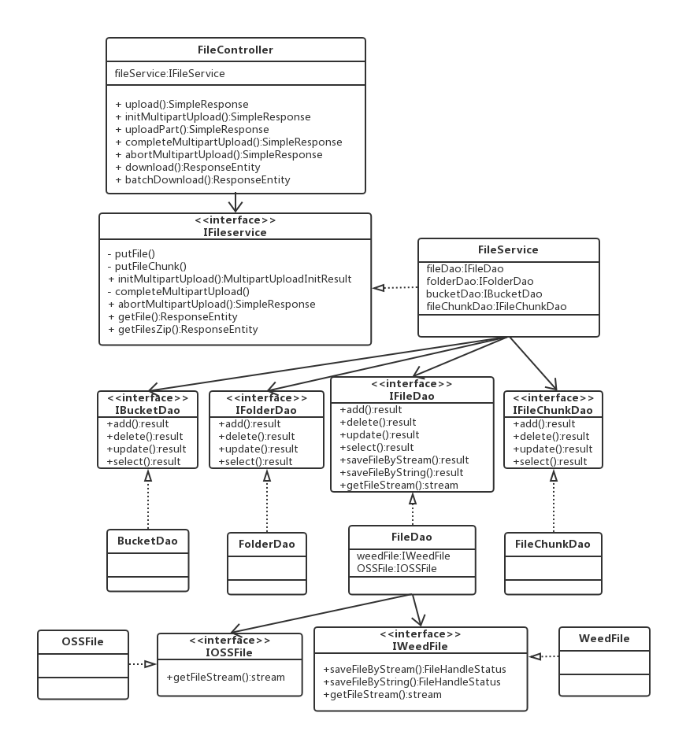

## 系统简介
   &emsp;&emsp;该系统基于开源的SeaweedFS文件系统，利用了其基本的分布式存储和备份功能。代理模块直接采用Spring Boot来搭建，数据层基于MySQL数据库，Druid作为数据库连接池，同时也带有可选的redis缓存，以加快数据的存取速度和减轻数据库负载。文件系统的管理模块使用MVC的设计思想，前端基于Thymeleaf模板技术，结合Bootstrap框架、jQuery库、AJAX技术实现数据的展示和近实时更新。
## 总体架构

&emsp;&emsp;如上图所示，在底层分布式文件系统之上搭建代理层，即该系统，所有的功能包括文件目录，文件上传下载的授权等都由该管理系统完成，文件流也经由此系统授权之后才流入或从磁盘读取出返回给客户端，这种方式虽然牺牲了部分性能，
但极大提高了系统的可维护性，也解决了原底层文件系统的单点故障问题。应用的文件微服务是FileService，前端在上传或下载私有文件前可以根据业务定义的权限从FileService请求授权签名，然后利用该签名直接从管理系统上传或下载私有文件，
与之相对比的OSS存储系统，两者所处的位置是一致的，从而也能够保证与OSS在顶层架构上的兼容。该架构图还展示出底层SeaweedFS的存储架构，它包含两个互为备份的数据中心，可以进行分布式集群部署，上层dfs-manager也可以多机部署，它将数据存储在数据库中，
同时也有部分数据缓存在Redis中以加快访问速度，减轻数据库服务器的压力。

&emsp;&emsp;结合SeaweedFS本身的分布式特性，同时考虑到系统的非功能性需求包括可用性，数据的安全性、性能、伸缩性等，将SeaweedFS的Master和Volume节点，管理系统以及它所依赖的Redis集群和数据库服务器集群按照如上图所示的方式进行部署。  
整个分布式文件系统所处的位置如图所示，它处在应用的下层，包含四个可稳定运行的集群，分别是底层文件存储集群，管理系统集群，Redis缓存集群和数据库服务器集群。底层文件存储集群部署方式较为复杂，为了确保数据的安全和不易丢失，将整个文件存储集群分为2个数据中心，
这两个中心互为数据备份，同时这种方式也能很好地均衡服务器及磁盘的读请求访问负载，因为同一份文件在两个数据中心都有存储，访问请求随机地路由到两个中心的任一一个，这取决于SeaweedFS的负载均衡配置。  
&emsp;&emsp;由于目前企业的实际机器状况，在3台服务器中均部署运行master节点，由于3台机器的性能有差别，Server2的机器性能较好，因此在Server2上运行较多的volume节点，分别属于不同的数据中心，其中一个volume节点按照规范应该是对应一个独立的磁盘，但是由于磁盘数量限制，
目前不同volume可能会复用同一块磁盘，可以通过购买廉价机械硬盘解决这个问题。其余2台机器的volume则相互隔离属于不同的数据中心，采用这种方式最大的优点和目的就是在机器数量限制的情况下避免单点故障导致一个数据中心的崩溃，比如，当这3台服务器中的任意一台宕机时，
其余2台均能够完成文件的写入和读取操作因为这2台均不在一个数据中心，这样极大地提高了系统的可用性，同时也对性能有一定优化作用。  
&emsp;&emsp;上游文件管理系统也采用集群化多实例的部署方式，由于该系统本身的无状态性，采用这种方式就不需要考虑分布式数据的一致性等问题。上层也只需配置类似于nignx的代理模块以实现负载均衡的功能。这样也会减轻高负载情况下的单机压力，同时减小单机故障导致整个服务不可用的概率。

## 数据库设计

- 存储空间表(bucket)  
在存储空间表中，每个存储空间都拥有一个唯一的主键id，其他属性包括name（名称），is_public（是否公开，用于区分公共读和私有读的空间），create_time（创建时间），modify_time（修改时间）。
- 文件夹表(folder)  
为了让文件在文件系统中具有特定的存储路径以方便管理和分类，引入了文件夹的概念，文件夹也通过唯一的主键id来区分，其他属性包括name（名称），path（路径），create_time（创建时间），modify_time（修改时间），其中path记录的是该文件夹的在一个存储空间的路径，类似于“affair/110904/files”这种格式，存储成这种格式的原因是当需要获取或删除一个文件夹下所有的文件及文件夹时，不需要递归地根据id去获取或删除，而可以直接通过字符串前缀匹配的方式来查找或删除，这样能够极大地减少数据库的访问次数，减小数据库服务器的压力，加快访问速度。name和path也能作为文件夹的唯一组合标示，因为同一文件夹下不能包含有相同名称的文件或文件夹。
- 文件表(file)  
与文件夹类似，文件包含的属性也包括id（主键），name（名称），path（路径），create_time（创建时间），modify_time（修改时间），path的含义与作用与文件夹相同。另外，文件还包含其他特有的属性包括size（文件大小），number（文件在底层文件系统中的标识），state（文件状态），文件状态适用于大文件传输状态记录，它包含三种状态，分别是默认状态，大文件正在上传状态，大文件上传完成状态。
- 文件碎片表(file_chunk)  
文件碎片的底层存储方式和文件相同，因此它也会存储该碎片在底层文件系统中的唯一标识即number，同时它也包含了id，create_time（创建时间），size（大小），offset（偏移量），这里记录的偏移量表示该碎片在大文件中的偏移量，用于在下载时将碎片按照偏移量拼接还原成大文件。

## 授权模块设计

&emsp;&emsp;授权验证的流程以下载文件为例如上图所示。在系统接收到下载文件请求时，首先需要根据参数中的bucket名称判断该文件是否在私有库中，如果是属于公共库的文件则直接请求底层文件系统返回文件流即可，如果是私有库的文件，在请求参数中应该有对应的签名信息，需要包含过期时间来判断签名的有效期，最后才判断签名本身是否匹配。  
&emsp;&emsp;签名应该包含的内容需要包括过期时间和签名本身的字符串。为了进一步提升安全性，防止非法的文件上传和下载，系统还会给签名引入AccessID和AccessKey的概念，AccessID类似于公钥，可以在互联网中进行传输，但AccessKey只能配置在上游应用系统和该文件管理系统中，它们是一一匹配的关系，签名的生成会依赖于此AccessKey。另外，为了区分不同的方法即是上传还是下载，这也会被加入到签名信息里，以及为了确保每次的签名只是操作的特定文件对象或者对象列表而不是整个空间，文件的绝对路径也会涵盖在签名信息中，以实现权限最小化的概念。

  
&emsp;&emsp;签名的生成目前采用HMAC-SHA1算法，但是为了之后的扩展性，采用了面向接口编程的设计方式，同时使用了简单工厂模式，如图3.13所示。IAuthDao提供了验证签名的接口给上层FileService使用，它依赖于ServiceSignature抽象类，该抽象类提供了create方法，用于创建签名计算算法，AuthDao在验证签名时会调用该方法获取签名计算算法实例再调用签名计算接口计算签名最后对比入参中的签名是否匹配。

## 文件上传/下载模块详细设计
  
&emsp;&emsp;文件上传/下载模块功能包括简单上传、大文件上传、简单文件下载和文件夹打包下载这四个详细的功能。其中简单上传即在通过签名验证之后直接将文件流写入底层文件系统，然后再将文件记录写入数据库，如果有重名文件则需要先在文件系统中删除该文件再上传。大文件上传比简单上传步骤较复杂，其流程图如上图所示。首先需要浏览器端判断文件大小是否超过设定的阈值，如果超过则需要对文件进行分片，在上传分片前需要先调用系统的初始化上传接口，在上传过程中可以主动终止文件上传，此时系统会将已上传的分片全部删除以节省空间，在分片上传完成之后也需要调用系统的完成上传接口通知系统将该大文件的元信息写入SeaweedFS中，大文件的元信息数据结构包括文件名，文件大小，文件mime信息，以及分片列表，每个分片的信息也在数据库设计时提到过，包括大小，偏移，在文件系统中的key值即Fid。如果上传过程被动终止比如网络断开，是不会调用终止上传接口的，就会产生无用的文件碎片，短期内用户重新上传时可以利用已上传的分片进行断点续传，而如果用户不再上传则会产生碎片垃圾，这就需要运维人员定期清理文件碎片以节省空间。  

 
&emsp;&emsp;如类图所示，以上传为例，首先文件流和签名参数会被Pipe层转发到对应的Controller中对应的方法。Controller类依赖下层的Service接口，Service类实现了文件上传下载的业务逻辑，由于业务逻辑中涉及到数据库或Redis的操作，因此它也依赖Dao实现数据的操作，Dao对Service屏蔽了底层数据操作的细节，Service不用关心数据写入或者从哪里读取。在进行文件读取时，Dao也会先访问Redis判断缓存中是否已经有文件，如果没有才会依赖SeaweedFS文件操作模块即IWeedFile接口获取文件，因此Dao也屏蔽了底层有关文件操作的细节，SeaweedFS文件操作模块对Dao层只暴露了这一个接口，内部的复杂存取逻辑由自身去实现，这会在下一节具体阐述，这里只画出了Dao直接依赖的IWeedFile接口。

